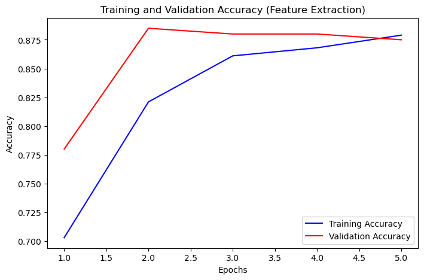
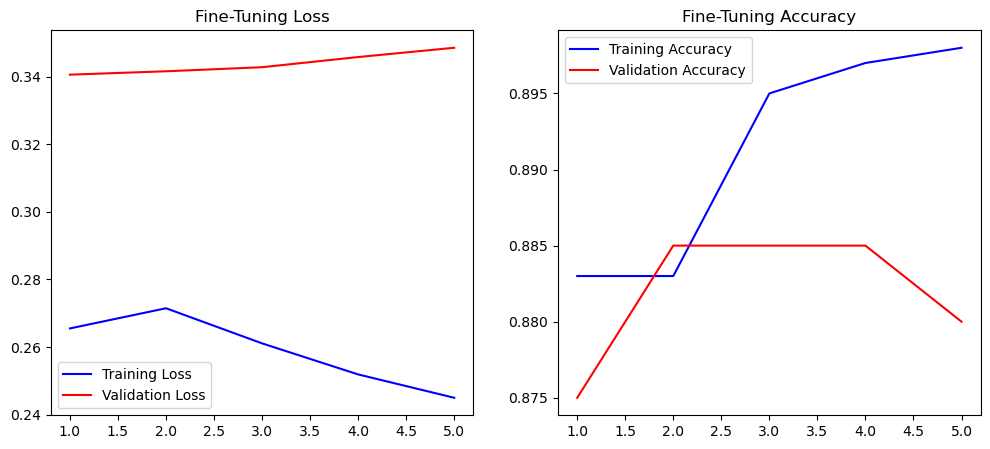

# Waste Classification using VGG16 Transfer Learning


## Overview
This project focuses on developing an AI-powered image classification model to assist **EcoClean** (a waste management organization) in automating the sorting of waste. 

Using **Transfer Learning** with the pre-trained **VGG16** architecture, the model classifies waste images into two categories:
* **Organic** (e.g., vegetables, leftovers)
* **Recyclable** (e.g., plastic, paper, glass)

## Key Features
* **Transfer Learning:** Utilized VGG16 (pre-trained on ImageNet) as the base feature extractor.
* **Data Augmentation:** Applied rotation, width/height shifts, and horizontal flips to reduce overfitting.
* **Fine-Tuning:** Unfroze the top layers of VGG16 to adapt the model specifically to the waste dataset.
* **Model Architecture:** * Base: VGG16 (Frozen/Unfrozen)
    * Head: Flatten -> Dense(256, ReLU) -> Dropout(0.5) -> Dense(1, Sigmoid)

## Dataset Structure
The dataset is organized into Train and Test directories:
dataset/ 
    ├── train/ 
        ├── O/ (Organic images) 
        └── R/ (Recyclable images)
    └── test/ 
        ├── O/ 
        └── R/

## Methodology & Results

### 1. Feature Extraction
* Frozen the VGG16 base.
* Trained only the custom classifier head.
* **Initial Accuracy:** 80% - 90% (87.5%) 

### 2. Fine-Tuning
* Unfroze the last block of VGG16 (Block 5).
* Re-compiled with a very low learning rate (`1e-5`) to preserve learned features.
* **Final Accuracy:** 80% - 90% (88%)

### 3. Performance Plots



## Installation & Usage

1.  **Clone the repository**
    ```bash
    git clone [https://github.com/PhucduonG09/AI_Enginnering.git](https://github.com/PhucduonG09/AI_Enginnering.git)
    cd Project_TensorFlow
    ```

2.  **Install dependencies**
    ```bash
    pip install tensorflow matplotlib numpy
    ```

3.  **Run the Notebook**
    Open `Final_Assignment.ipynb` in Jupyter Notebook or VS Code and run the cells.

## Author
**Duong The Phuc**
* Student at Phenikaa University - AI Major
* GitHub: [PhucduonG09](https://github.com/PhucduonG09)